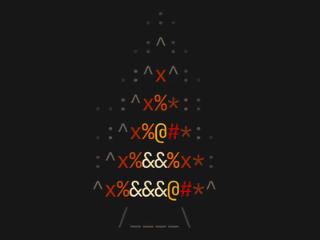
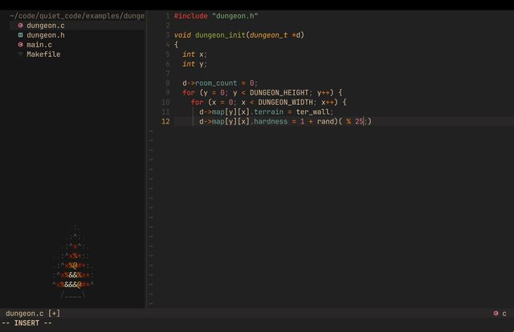

# ember.nvim

Animated ASCII heat-map widgets for Neovim, built with floating windows and highlight groups instead of terminal escape rendering.





## Features

- Standalone Neovim plugin with `setup`, `start`, `stop`, `toggle`, `set_intensity`, `stats`, and `benchmark`
- Multiple scenes: classic fire, a smooth lava metaball scene, and a looping ember spiral
- Non-focusable floating window that survives buffer switching
- Palette system with `auto`, `gruvbox`, `default`, or custom highlight specs
- Optional `nvim-tree` attach mode with automatic fallback to float mode
- Commands: `:EmberStart`, `:EmberStop`, `:EmberToggle`, `:EmberBenchmark`

## Recent Performance Work

- Replaced per-cell highlight updates with contiguous highlight runs.
- Switched frame updates to dirty-row writes with a full-frame fallback threshold.
- Added reusable renderer buffers and row-aware frame materialization to cut steady-state allocations.
- Added runtime profiling with `stats()` and benchmark breakdowns for render, line updates, namespace clears, and highlights.
- Tuned the spiral scene to reduce expensive math and dramatically reduce full rewrites on larger canvases.

In the current benchmark pass, `spiral 80x24` improved from roughly `0.48ms` to `0.26ms` average frame time while also dropping from frequent full rewrites to only occasional ones.

In practice, that means ember should feel much lighter during normal editing, especially on larger windows or when running the spiral scene for long sessions.

## Installation

### lazy.nvim

```lua
{
  "yourname/ember.nvim",
  config = function()
    require("ember").setup({
      width = 33,
      height = 12,
      fps = 8,
      scene = "fire",
      palette = "auto",
      heat_levels = 11,
      full_rewrite_threshold = 0.6,
      char_ramp = { " ", ".", ":", "^", "*", "x", "#", "%", "@", "&" },
      adaptive_fps = {
        enabled = false,
        idle_fps = 4,
        active_fps = 8,
      },
      wave = {
        enabled = true,
        style = "sway_breathe",
        amount = "subtle",
      },
      attach = {
        mode = "nvim-tree",
      },
    })
  end,
}
```

### packer.nvim

```lua
use({
  "yourname/ember.nvim",
  config = function()
    require("ember").setup()
  end,
})
```

## Usage

```lua
require("ember").setup()
require("ember").start()
require("ember").start({ scene = "lava" })
require("ember").start({ scene = "spiral" })
require("ember").stop()
require("ember").toggle()
require("ember").set_intensity(0.4)
require("ember").stats()
require("ember").benchmark({ frames = 180 })
```

The public API is intentionally small so other plugins, statusline setups, or personal automation can script it easily:

```lua
require("ember").start({ width = 33, height = 12, fps = 8 })
require("ember").stop()
require("ember").set_intensity(0.4)
require("ember").stats()
require("ember").benchmark({ frames = 180 })
```

## Lava Example

```lua
require("ember").setup({
  scene = "lava",
  lava = {
    blobs = 4,
    speed = 0.16,
    pulse_amount = 0.08,
  },
})
```

## Spiral Example

```lua
require("ember").setup({
  scene = "spiral",
  width = 33,
  height = 12,
  spiral = {
    turns = 1.9,
    thickness = 1.2,
    rotation_speed = 0.24,
    pulse_amount = 0.08,
  },
})
```

## Gruvbox Example

```lua
require("ember").setup({
  palette = "gruvbox",
  attach = {
    mode = "nvim-tree",
  },
})
```

## Battery-Friendly Example

```lua
require("ember").setup({
  fps = 6,
  intensity = 0.45,
  adaptive_fps = {
    enabled = true,
    idle_fps = 3,
    active_fps = 6,
  },
})
```

## Commands

- `:EmberStart`
- `:EmberStop`
- `:EmberToggle`
- `:EmberBenchmark [frames]`

## Configuration

```lua
require("ember").setup({
  width = 33,
  height = 12,
  fps = 8,
  adaptive_fps = {
    enabled = false,
    idle_fps = 4,
    active_fps = 8,
  },
  full_rewrite_threshold = 0.6,
  scene = "fire", -- "fire" | "spiral" | "lava"
  zindex = 40,
  border = "none",
  row_offset = 1,
  col_offset = 0,
  intensity = 0.65,
  palette = "auto", -- "auto" | "gruvbox" | "default" | custom table
  heat_levels = 11,
  char_ramp = { " ", ".", ":", "^", "*", "x", "#", "%", "@", "&" },
  wave = {
    enabled = true,
    style = "sway_breathe",
    amount = "subtle",
  },
  lava = {
    blobs = 4,
    speed = 0.16,
    pulse_amount = 0.08,
    center_bias_x = 0,
    center_bias_y = 0,
  },
  spiral = {
    turns = 1.85,
    thickness = 1.15,
    rotation_speed = 0.24,
    pulse_amount = 0.08,
    center_bias_x = 0,
    center_bias_y = 0,
  },
  force_palette = false,
  attach = {
    mode = "nvim-tree", -- "float" | "editor" | "nvim-tree"
    position = "bottom-left",
  },
})
```

`wave.amount` supports `subtle`, `medium`, and `pronounced` for the `fire` scene. The default `subtle` profile uses a slow sway and breathing cycle for ambient motion rather than dramatic oscillation.

The `spiral` table applies only to `scene = "spiral"` and controls the vortex turns, width, rotation speed, pulse, and center offset.

The `lava` table applies only to `scene = "lava"` and controls how many soft blobs drift through the widget, how quickly they move, how much they pulse, and how the whole scene is biased within the window. Lava is a smooth metaball-like scene that uses the same warm ember palette and char ramp.

`adaptive_fps` is optional and drops to `idle_fps` when ember is visually quiet, then returns to `active_fps` as motion picks back up. `full_rewrite_threshold` controls when the renderer stops doing dirty-row updates and rewrites the entire frame instead.

`require("ember").stats()` returns cumulative runtime counters for frames, dirty rows, rewritten rows, `nvim_buf_set_lines` calls, highlight calls, and timing breakdowns for render, line updates, namespace clears, and highlight work. `require("ember").benchmark()` runs an offscreen benchmark using the current config shape and returns the same timing categories as per-frame averages.

Custom palettes use the same shape passed to `nvim_set_hl`:

```lua
require("ember").setup({
  custom_palette = {
    { fg = "#282828" },
    { fg = "#3c3836" },
    { fg = "#504945" },
    { fg = "#665c54" },
    { fg = "#7c6f64" },
    { fg = "#8f3f1f" },
    { fg = "#af3a03" },
    { fg = "#cc241d" },
    { fg = "#d65d0e" },
    { fg = "#fe8019" },
    { fg = "#fabd2f" },
    { fg = "#fbf1c7" },
  },
})
```

Users and themes can also define `EmberFire0` through `EmberFire11` directly if they want full control over the rendered colors.

## Changelog

See [CHANGELOG.md](CHANGELOG.md) for the current optimization summary and release notes.

## Health Check

Run `:checkhealth ember` to confirm Neovim version support and optional `nvim-tree` integration availability.
