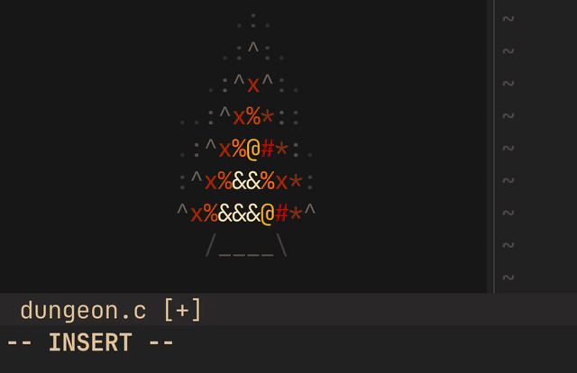
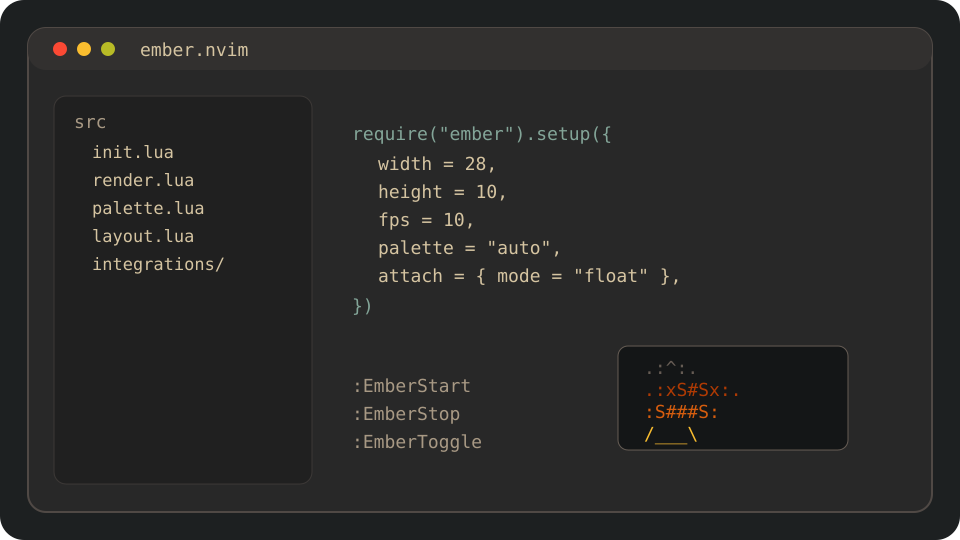

# ember.nvim

Animated ASCII campfire for Neovim, built with floating windows and highlight groups instead of terminal escape rendering.






## Features

- Standalone Neovim plugin with `setup`, `start`, `stop`, `toggle`, and `set_intensity`
- Non-focusable floating window that survives buffer switching
- Palette system with `auto`, `gruvbox`, `default`, or custom highlight specs
- Optional `nvim-tree` attach mode with automatic fallback to float mode
- Commands: `:EmberStart`, `:EmberStop`, `:EmberToggle`

## Installation

### lazy.nvim

```lua
{
  "yourname/ember.nvim",
  config = function()
    require("ember").setup({
      width = 33,
      height = 12,
      fps = 10,
      palette = "auto",
      heat_levels = 11,
      char_ramp = { " ", ".", ":", "^", "*", "x", "#", "%", "@", "&" },
      wave = {
        enabled = true,
        style = "sway_breathe",
        amount = "subtle",
      },
      attach = {
        mode = "nvim-tree",
      },
    })
  end,
}
```

### packer.nvim

```lua
use({
  "yourname/ember.nvim",
  config = function()
    require("ember").setup()
  end,
})
```

## Usage

```lua
require("ember").setup()
require("ember").start()
require("ember").stop()
require("ember").toggle()
require("ember").set_intensity(0.4)
```

The public API is intentionally small so other plugins, statusline setups, or personal automation can script it easily:

```lua
require("ember").start({ width = 33, height = 12, fps = 10 })
require("ember").stop()
require("ember").set_intensity(0.4)
```

## Gruvbox Example

```lua
require("ember").setup({
  palette = "gruvbox",
  attach = {
    mode = "nvim-tree",
  },
})
```

## Commands

- `:EmberStart`
- `:EmberStop`
- `:EmberToggle`

## Configuration

```lua
require("ember").setup({
  width = 33,
  height = 12,
  fps = 10,
  zindex = 40,
  border = "none",
  row_offset = 1,
  col_offset = 0,
  intensity = 0.65,
  palette = "auto", -- "auto" | "gruvbox" | "default" | custom table
  heat_levels = 11,
  char_ramp = { " ", ".", ":", "^", "*", "x", "#", "%", "@", "&" },
  wave = {
    enabled = true,
    style = "sway_breathe",
    amount = "subtle",
  },
  force_palette = false,
  attach = {
    mode = "nvim-tree", -- "float" | "editor" | "nvim-tree"
    position = "bottom-left",
  },
})
```

`wave.amount` currently supports `subtle`, `medium`, and `pronounced`. The default `subtle` profile uses a slow sway and breathing cycle for ambient motion rather than dramatic oscillation.

Custom palettes use the same shape passed to `nvim_set_hl`:

```lua
require("ember").setup({
  custom_palette = {
    { fg = "#282828" },
    { fg = "#3c3836" },
    { fg = "#504945" },
    { fg = "#665c54" },
    { fg = "#7c6f64" },
    { fg = "#8f3f1f" },
    { fg = "#af3a03" },
    { fg = "#cc241d" },
    { fg = "#d65d0e" },
    { fg = "#fe8019" },
    { fg = "#fabd2f" },
    { fg = "#fbf1c7" },
  },
})
```

Users and themes can also define `EmberFire0` through `EmberFire11` directly if they want full control over the rendered colors.

## Health Check

Run `:checkhealth ember` to confirm Neovim version support and optional `nvim-tree` integration availability.
